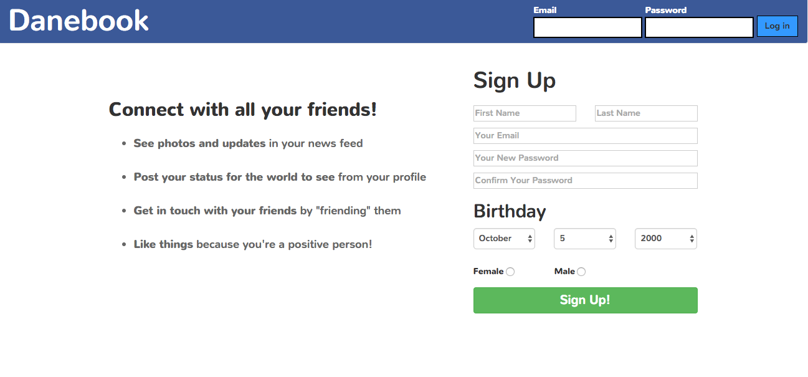

# Danebook

Check it out [here!](https://mikedanebook.herokuapp.com)

## Overview

Danebook is a social networking platform built with full functionality. Users are able to create posts, like and comment on posts, upload photos, and friend other users. 

### Features

Users can:
* Write posts and upload photos
* Comment on posts from other users
* Friend other users
* Keep track of recent activity

## Developer

Created by [Mike Lee](https://github.com/asackofwheat)